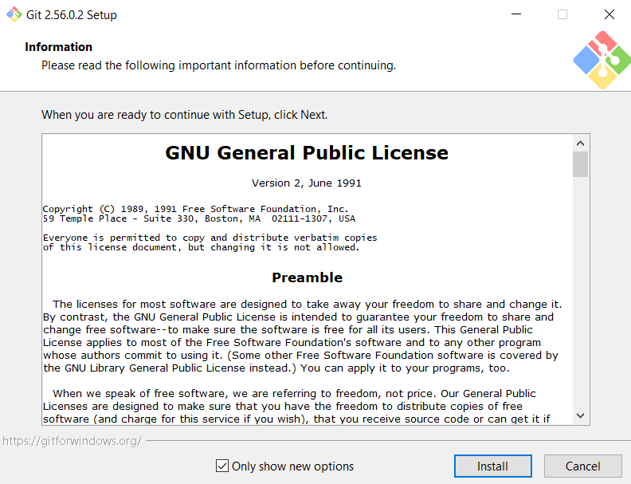

# LAPORAN PRAKTIKUM SISTEM TERDISTRIBUSI DAN TERDESTRALISASI

## PERTEMUAN 01

## Nama :

## Nim :

## kelas :

## TUJUAN PRAKTIKUM

## DASAR TEORI

## 1. INSTALL IT

## 2. GIT KONFIGURASI

## 3. CREATE REPOSITORY

## 4.

setelah itu .................
