# LAPORAN PRAKTIKUM SISTEM TERDISTRIBUSI DAN TERDESTRALISASI

## PERTEMUAN 01

## Nama : Apriliva Putri P

## Nim : 255410035

## Kelas : Informatika-1

## TUJUAN PRAKTIKUM

Tujuan dari praktikum ini adalah untuk memahami konsep dasar sistem terdistribusi dan terdesentralisasi, serta mempelajari pengelolaan repositori menggunakan Git dan GitHub. Mahasiswa diharapkan dapat:

- Menginstal perangkat lunak Git pada sistem operasi Windows.
- Melakukan konfigurasi identitas pengguna Git.
- Membuat dan mengelola repository lokal maupun remote.
- Menggunakan branch untuk pengembangan fitur yang terisolasi.
- Melakukan commit, push, dan pull request sebagai mekanisme kolaborasi.
- Memahami alur kerja distributed version control yang umum digunakan dalam pengembangan perangkat lunak modern.

## DASAR TEORI

Sistem terdistribusi adalah sistem komputer yang terdiri dari beberapa komputer atau node yang saling terhubung dan bekerja sama untuk menyelesaikan suatu tugas. Dalam pengembangan perangkat lunak, model kerja seperti ini sering diterapkan melalui sistem kontrol versi yang memungkinkan banyak pengembang bekerja secara terkoordinasi tanpa kehilangan data atau perubahan.

Git merupakan salah satu sistem kontrol versi terdistribusi (Distributed Version Control System/DVCS) yang dirancang untuk melacak perubahan pada file secara efisien. Git memungkinkan pengguna membuat snapshot dari project, sehingga perubahan yang dilakukan sebelumnya dapat dilihat, dikelola, dan dikembalikan jika dibutuhkan.

Beberapa konsep penting dalam Git adalah:

- Repository (repo): tempat penyimpanan semua data proyek.
- Commit: catatan perubahan yang disimpan secara permanen dalam repo.
- Branch: cabang kerja yang memungkinkan pengembangan fitur baru tanpa mengganggu branch utama.
- Merge: penggabungan perubahan dari branch lain ke branch utama.
- Pull request: mekanisme untuk mengajukan perubahan agar ditinjau sebelum digabungkan.
- Remote: repositori jarak jauh, seperti GitHub, yang digunakan untuk berkolaborasi.

Dengan Git, setiap pengguna memiliki salinan lokal repositori, sehingga kerja dapat dilakukan secara mandiri dan tetap terhubung ke repositori pusat untuk sinkronisasi dan kolaborasi.

## ALAT DAN BAHAN

- Laptop/PC dengan sistem operasi Windows.
- Aplikasi Git untuk Windows.
- Editor teks/IDE seperti Visual Studio Code.
- Akun GitHub untuk repository remote.

## 1. INSTALASI GIT

Pada tahap awal, dilakukan instalasi Git pada sistem. Proses instalasi diawali dengan mengunduh installer Git untuk Windows dan menjalankannya. Pada tampilan instalasi, terdapat beberapa komponen dasar yang dipilih agar Git dapat berjalan dengan baik pada lingkungan Windows.


Gambar 1. Proses instalasi Git pada sistem Windows.

Selanjutnya, dilakukan pemilihan komponen yang akan diinstal. Komponen utama mencakup Git Bash, Git GUI, serta fitur-fitur dukungan untuk penggunaan pada lingkungan command line dan editor tertentu. Proses ini sangat penting agar Git dapat digunakan secara optimal dalam pengembangan software.

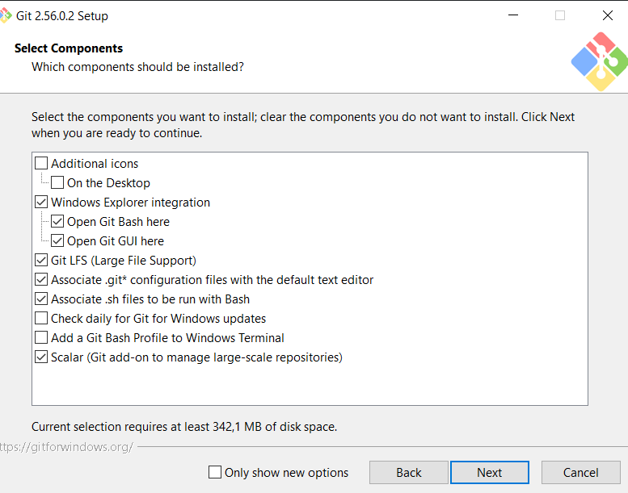

Gambar 2. Pemilihan komponen instalasi Git.

Pada tahap berikutnya, user memilih editor default yang akan digunakan saat Git membuka file konfigurasi atau melakukan interaksi melalui Git Bash. Dalam praktikum ini digunakan editor yang mendukung pengalaman kerja yang nyaman dan familiar.

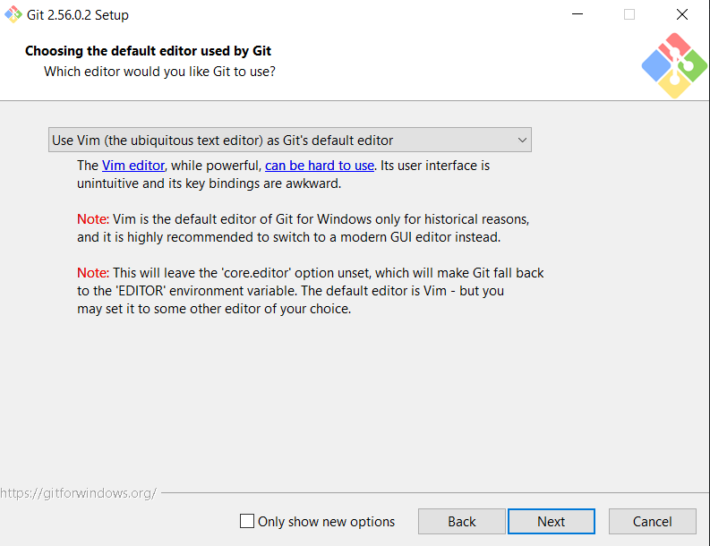

Gambar 3. Pemilihan editor default untuk Git.

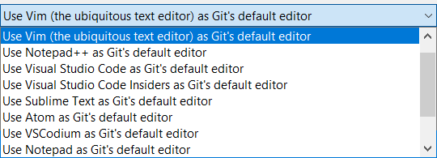

Gambar 4. Pilihan editor teks yang tersedia selama instalasi.

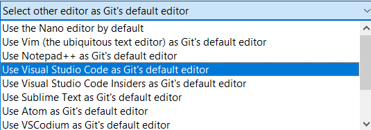

Gambar 5. Konfigurasi editor Visual Studio Code sebagai editor default.

Setelah semua pengaturan utama dipilih, proses instalasi dilanjutkan dengan konfigurasi lingkungan Git. Pada tahapan ini, sistem menyiapkan kebutuhan dasar seperti terminal, kompatibilitas command line, dan opsi tambahan seperti Git Credential Manager.

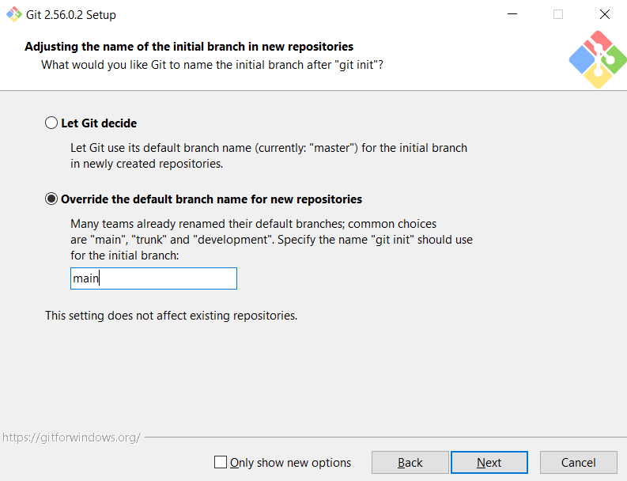

Gambar 6. Pengaturan repositori Git dan opsi tambahan instalasi.

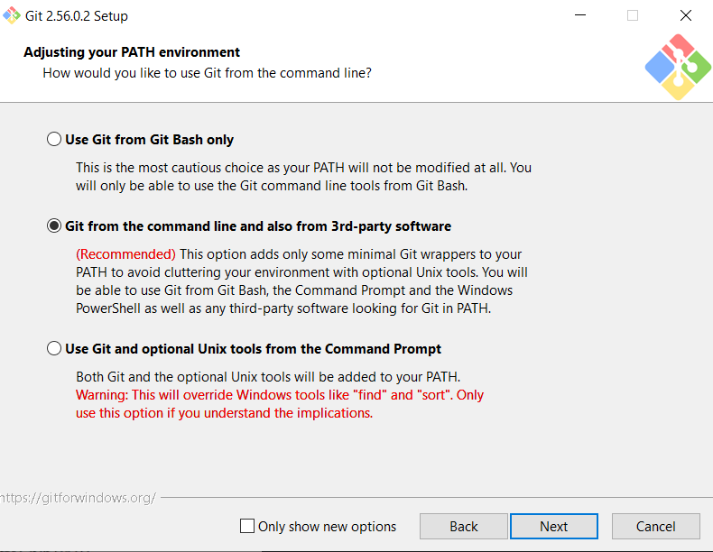

Gambar 7. Proses instalasi Git sedang berjalan.

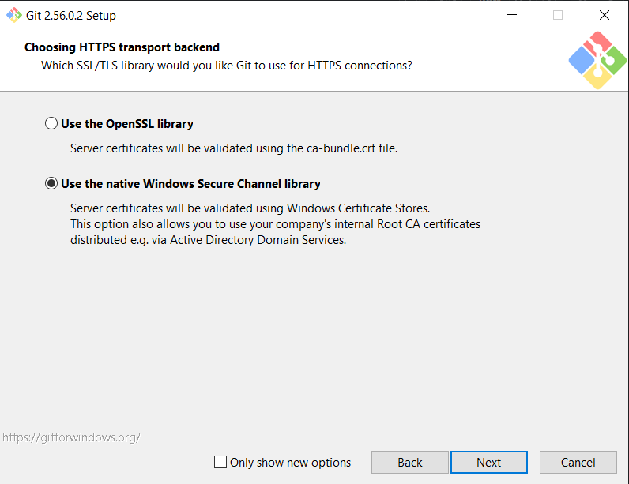

Gambar 8. Opsi configurasi native pada lingkungan Git.

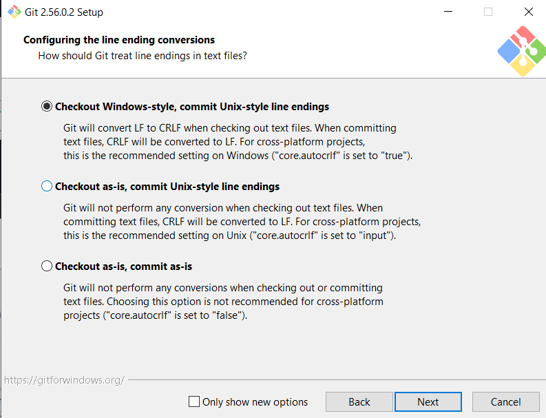

Gambar 9. Proses konfigurasi konversi line ending.

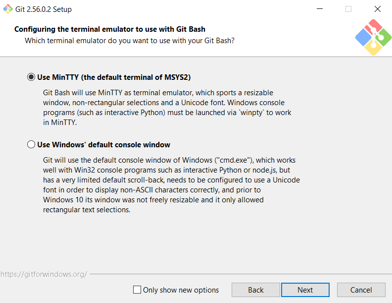

Gambar 10. Pengaturan terminal MinTTY untuk lingkungan Git Bash.

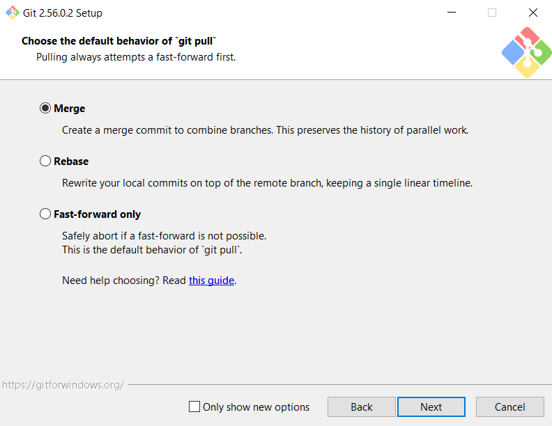

Gambar 11. Pengaturan git pull dan merge default.

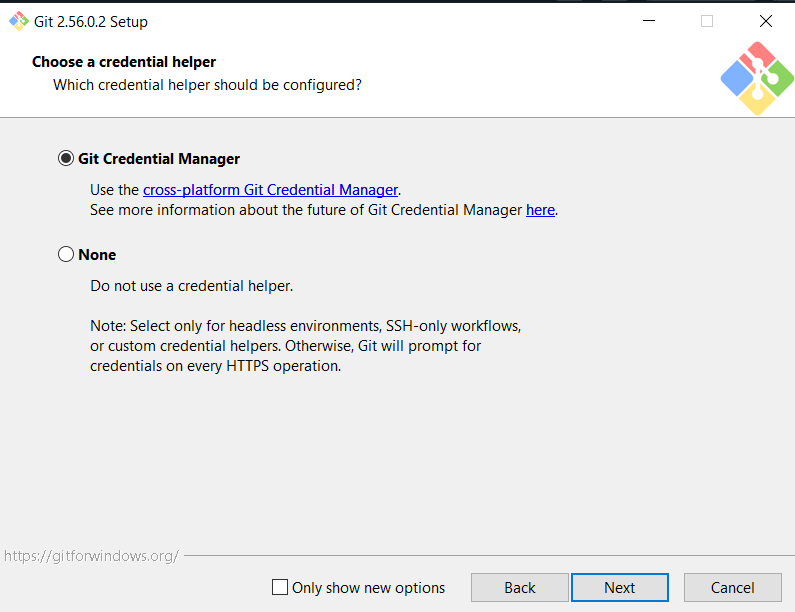

Gambar 12. Konfigurasi credential manager untuk autentikasi.

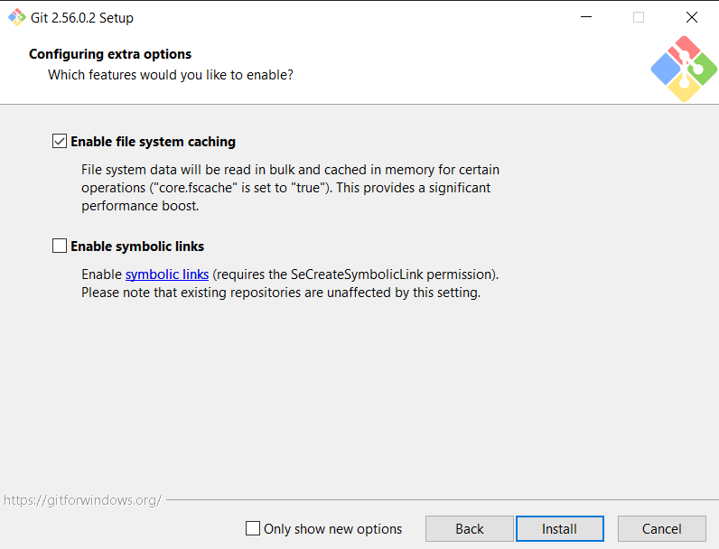

Gambar 13. Opsi tambahan yang tersedia selama instalasi.

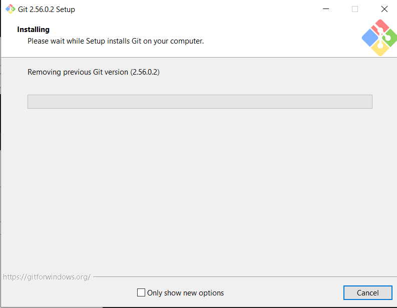

Gambar 14. Proses instalasi Git sedang selesai.

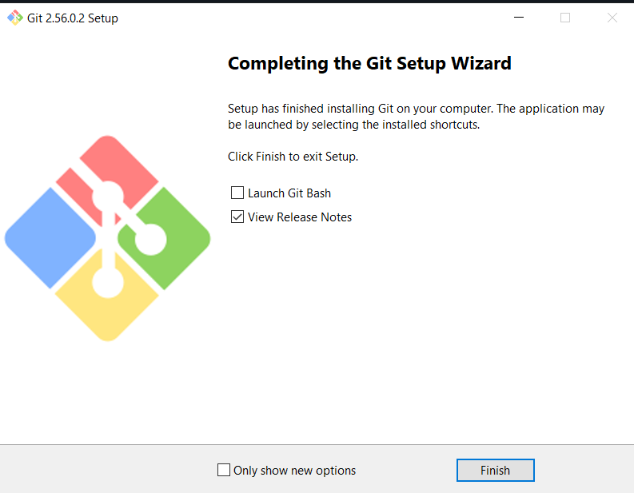

Gambar 15. Instalasi Git berhasil selesai.

## 2. KONFIGURASI GIT

Setelah instalasi selesai, dilakukan pengecekan versi Git untuk memastikan program terpasang dengan benar. Selanjutnya dilakukan konfigurasi identitas pengguna seperti nama dan email. Konfigurasi ini penting agar setiap commit yang dibuat tercatat dengan benar dan dapat dilacak oleh pengguna yang melakukan perubahan.

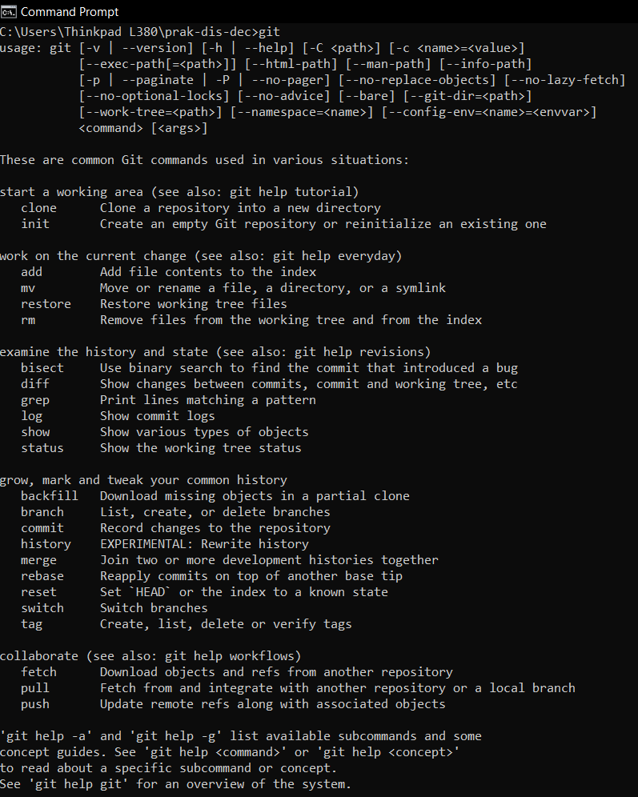

Gambar 16. Verifikasi Git telah terinstal.

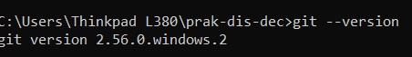

Gambar 17. Pengecekan versi Git yang terpasang.

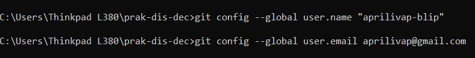

Gambar 18. Konfigurasi user.name dan user.email pada Git.

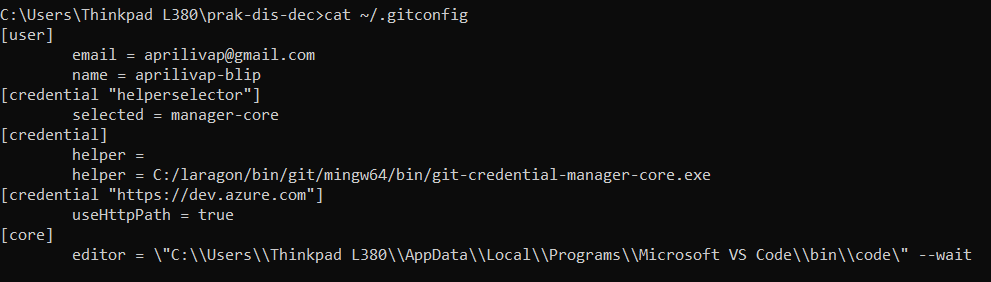

Gambar 19. Verifikasi konfigurasi Git melalui file konfigurasi.

Konfigurasi dapat dilakukan dengan perintah seperti:

```bash
git config --global user.name "Nama Mahasiswa"
git config --global user.email "email@mahasiswa.ac.id"
```

Perintah tersebut akan menyimpan identitas pengguna secara global di komputer, sehingga semua proyek yang dibuat akan terhubung dengan akun tersebut.

## 3. MEMBUAT REPOSITORY BARU

Setelah konfigurasi selesai, langkah berikutnya adalah membuat repositori baru. Repository dapat dibuat di GitHub sebagai remote repo maupun di lokal untuk kebutuhan development. Praktikum ini memulai dengan membuat repositori baru di GitHub agar perubahan dapat diakses secara online dan dikelola secara kolaboratif.

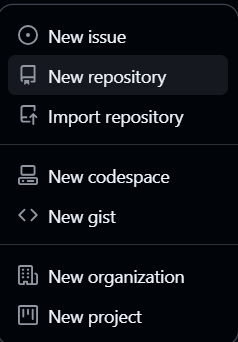

Gambar 20. Tampilan menu untuk membuat repository baru di GitHub.

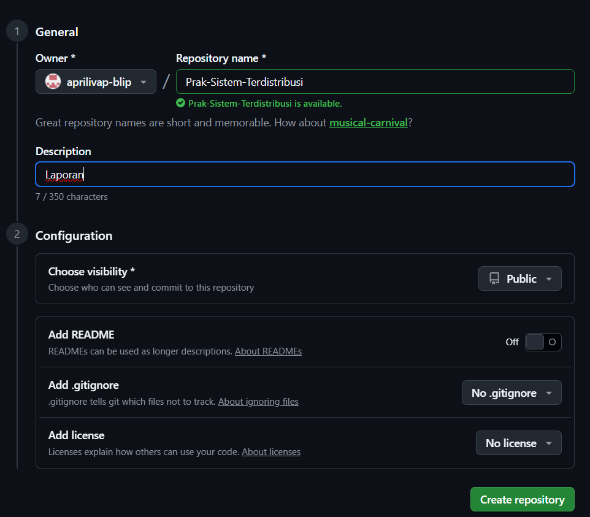

Gambar 21. Form pembuatan repository baru.

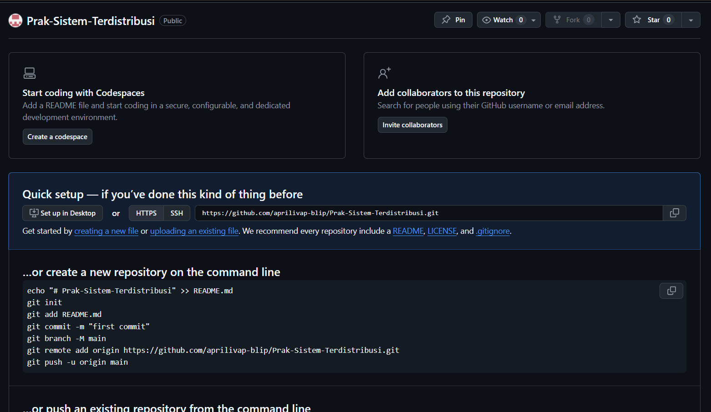

Gambar 22. Repository baru berhasil dibuat.

Pada tahap ini, nama repository dibuat sesuai kebutuhan praktikum, yaitu repository yang akan digunakan sebagai penyimpanan project. Setelah repo dibuat, selanjutnya dilakukan clone repository ke komputer lokal agar file dapat dikelola secara langsung.

## 4. CLONE REPOSITORY DAN PENGOLAHAN FILE

Setelah repositori baru dibuat, dilakukan cloning dari GitHub ke direktori lokal. Langkah ini penting agar proyek dapat dikerjakan di komputer local dan disinkronkan dengan repositori remote.

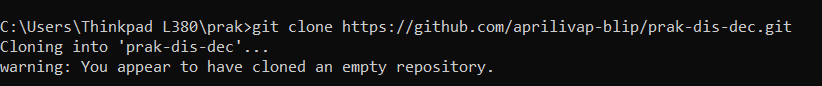

Gambar 23. Proses cloning repository ke komputer lokal.

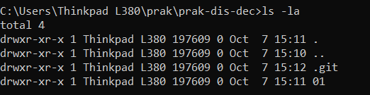

Gambar 24. Pemeriksaan isi folder hasil clone dengan perintah ls -la.

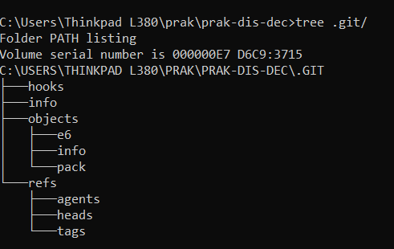

Gambar 25. Struktur direktori proyek yang sudah ter-clone.

Pada tahap ini, terlihat bahwa repository telah terhubung dengan GitHub dan berisi struktur folder yang siap untuk dimodifikasi. Perintah `ls -la` dan `tree` digunakan untuk memeriksa isi direktori agar struktur kerja project dapat dipahami dengan jelas.

## 5. MENGELOLA BRANCH, COMMIT, DAN PULL REQUEST

Distributed version control memungkinkan pengembangan dilakukan pada cabang-cabang terpisah. Praktikum ini dilakukan dengan membuat branch baru agar perubahan yang dibuat tidak langsung memengaruhi branch utama.

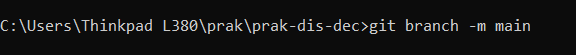

Gambar 26. Pengecekan branch yang tersedia.

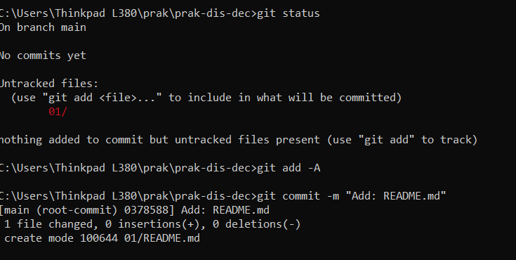

Gambar 27. Proses pengelolaan repository dan branch.


Gambar 28. Pembuatan branch baru untuk pengembangan perubahan.

Setelah branch baru dibuat, dilakukan penambahan perubahan pada file proyek. Perubahan tersebut kemudian disimpan ke staging area dan dibuat menjadi commit.


Gambar 29. Proses git add dan git commit pada branch baru.

Setelah commit berhasil dibuat, perubahan kemudian diusulkan ke branch utama melalui pull request. Pull request berfungsi sebagai mekanisme review sebelum perubahan digabungkan.


Gambar 30. Pembuatan pull request dari branch baru.


Gambar 31. Hasil pembuatan pull request beserta statusnya.

Setelah pull request dibuat, dilakukan proses sinkronisasi dengan pembaruan dari branch yang sudah digabungkan. Proses ini mengikuti prinsip Git yang memungkinkan semua collaborator tetap memiliki versi terbarunya.


Gambar 32. Proses git pull untuk mengambil perubahan terbaru.

## HASIL PRAKTIKUM

Dari serangkaian kegiatan praktikum tersebut, diperoleh beberapa hasil penting:

1. Git berhasil diinstal dan dikonfigurasi dengan benar pada sistem Windows.
2. Repository berhasil dibuat dan dihubungkan dengan GitHub sebagai remote repository.
3. Proses clone repository ke komputer lokal berjalan dengan baik.
4. Penggunaan branch membantu memisahkan pekerjaan dan menghindari konflik pada branch utama.
5. Commit dapat dibuat secara terstruktur dan terdokumentasi.
6. Pull request berhasil dibuat untuk mengusulkan perubahan agar ditinjau sebelum digabungkan.
7. Sinkronisasi melalui `git pull` membuktikan bahwa Git bekerja sesuai prinsip DVCS dalam mendukung kolaborasi.

## PEMBAHASAN

Praktikum ini memberikan pemahaman bahwa Git bukan hanya alat penyimpan file, tetapi juga alat kolaborasi yang sangat penting dalam pengembangan perangkat lunak. Dalam sistem terdistribusi, setiap pengguna memiliki salinan kerja yang lengkap, sehingga pengembangan dapat dilakukan secara paralel. Ketika perubahan sudah siap, hasilnya dapat dipublikasikan ke remote repository dan diajukan untuk review.

Konsep branch juga sangat penting karena memungkinkan pengembangan dilakukan tanpa mengganggu pekerjaan orang lain. Dengan mekanisme commit dan merge, perubahan dapat dikelola dengan lebih aman. Pull request menjadi elemen penting dalam proses review, terutama ketika proyek dikerjakan oleh banyak kontributor.

## KESIMPULAN

Berdasarkan praktikum yang telah dilakukan, dapat disimpulkan bahwa Git merupakan alat yang sangat penting dalam pengembangan sistem terdistribusi dan terdesentralisasi. Penggunaan Git mempermudah pengelolaan versi proyek, kolaborasi antar pengembang, serta pemeliharaan kualitas kode. Instalasi, konfigurasi, repository, branch, commit, dan pull request merupakan tahapan dasar yang harus dikuasai sebelum bekerja dalam ekosistem pengembangan perangkat lunak modern.

Dengan memahami mekanisme kerja Git dan GitHub, mahasiswa dapat mengembangkan kemampuan kolaborasi dalam tim serta menjaga integritas dan konsistensi project. Praktikum ini juga menegaskan bahwa kontrol versi menjadi fondasi utama dalam pengembangan perangkat lunak yang terstruktur, aman, dan mudah dikelola.

## DAFTAR PUSTAKA

1. Chacon, S., & Straub, B. (2014). Pro Git. Apress.
2. Git Documentation. (2025). https://git-scm.com/doc
3. GitHub Guides. https://docs.github.com
